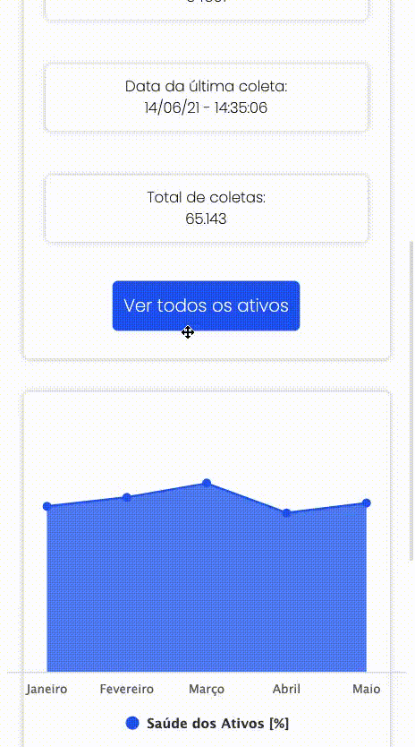

## <a href="https://tractian-desafio-frontend.vercel.app/">Demo</a>

## :page_with_curl: Descrição do projeto
Teste prático proposto pela Tractian para o trabalho de desenvolvedor front-end.

## :iphone: Sistema responsivo

## :hammer: Tecnologias utilizadas
- [React](https://reactjs.org)
- [Highcharts-react-oficial](https://github.com/highcharts/highcharts-react)
- [Highcharts](https://www.highcharts.com/) 

## :computer: Como rodar o projeto

**Você pode clonar o projeto e rodá-lo localmente seguindo os passos abaixo**

1. `$ git clone https://github.com/g0m3s/tractian-desafio-frontend.git` para clonar o projeto
2. `$ yarn install` para instalar as dependências do projeto
3. `$ npm install` para instalar as dependências do projeto
4. `$ yarn start` para iniciar o servidor local

## Faltante
 - Criação e atualização de ativos

## Autor
---

<a href="https://github.com/g0m3s">

 
<b>Gabriel de Matos Gomes</b></a> 
